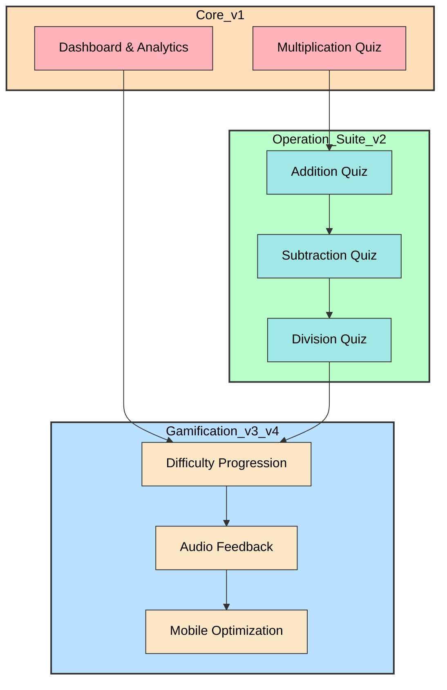
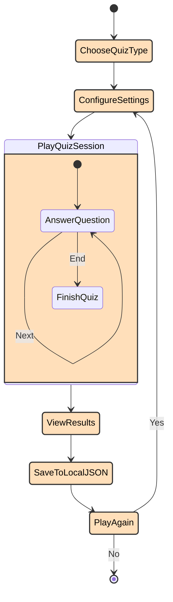
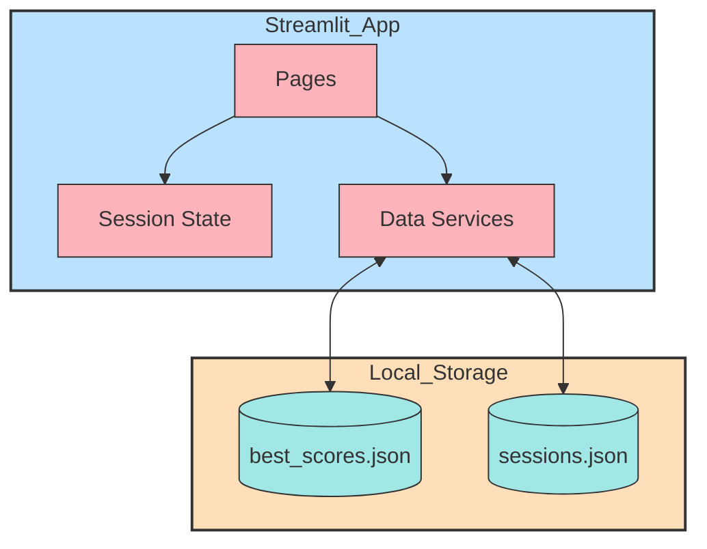

# Math Game Quiz - Architecture Overview (Updated)

## Simplified Feature Structure



```
┌─────────────────────────────────────────────────────────┐
│     Math Game Quiz - Local-Only Learning App            │
│                                                          │
│  🎯 Mission: Kids learn math through fun games         │
│  📍 Scope: Single session, local only                  │
│  🔒 Privacy: Zero tracking, zero server               │
│  📂 Data: Session-local JSON files only                │
└─────────────────────────────────────────────────────────┘

┌────────────────────────────────────────────────────────────┐
│                    CORE FEATURES (v1.0)                    │
│                                                             │
│  ✅ Multiplication Quiz      - Times tables practice       │
│  ✅ Dashboard & Analytics    - Session history only        │
└────────────────────────────────────────────────────────────┘
                              ↓

┌────────────────────────────────────────────────────────────┐
│              OPERATION SUITE (v2.0 - Q2 2024)              │
│                                                             │
│  ✅ Multiplication Quiz     - Times tables practice        │
│  🔄 Addition Quiz           - Single & double digit (NEW)  │
│  🔄 Subtraction Quiz        - Age-appropriate (no negatives) │
│  🔄 Division Quiz           - With remainder handling      │
└────────────────────────────────────────────────────────────┘
                              ↓

┌────────────────────────────────────────────────────────────┐
│           GAMIFICATION & UX (v3.0-v4.0)                   │
│                                                             │
│  🔄 Difficulty Progression - Auto-adjust in current quiz   │
│  🔄 Audio Feedback         - Sound effects (optional)      │
│  🔄 Mobile Optimization    - Touch-friendly UI             │
└────────────────────────────────────────────────────────────┘

                    ❌ REMOVED FEATURES

     🚫 User Profiles        - No persistent identity
     🚫 Parent Portal        - No tracking/monitoring
     🚫 Leaderboards         - Requires server management
     🚫 Achievement Badges   - Requires server storage
     🚫 Server Infrastructure - No cloud needed
     🚫 User Authentication  - No accounts required
```

---

## Session Lifecycle (Local-Only Model)



```
START
  ↓
  ┌──────────────────────────┐
  │ 1. Choose Quiz Type      │
  │    (Multiplication, etc) │
  │    (Addition) ← NEW      │
  └────────────┬─────────────┘
           ↓
  ┌──────────────────────────┐
  │ 2. Configure Settings    │
  │    (tables, difficulty)  │
  └────────┬─────────────────┘
           ↓
  ┌──────────────────────────┐
  │ 3. Play Quiz Session     │
  │    (timed questions)     │
  │    [SESSION-LOCAL DATA]  │
  │    (in memory only)      │
  └────────┬─────────────────┘
           ↓
  ┌──────────────────────────┐
  │ 4. View Results & Stats  │
  │    - Score, accuracy     │
  │    - Per-table breakdown │
  │    - Best score today    │
  │    [saved to local JSON] │
  └────────┬─────────────────┘
           ↓
  ┌──────────────────────────┐
  │ 5. Play Again or Exit    │
  ├──────────────────────────┤
  │ ✅ Play Again            │
  │    → Back to Step 2      │
  │    (fresh session)       │
  │                          │
  │ ❌ Exit                  │
  │    → ALL DATA CLEARED    │
  │    (except today's best) │
  └────────┬─────────────────┘
           ↓
        END
        
        [Data Persistence]
        └─ Today's Best Scores  (best_scores.json)
        └─ Session History      (sessions.json)
        └─ No User Profiles
        └─ No Cross-Session Tracking
```

---

## Data Architecture (No Server)



```
┌──────────────────────────────────────────────────────────────┐
│                STREAMLIT WEB APPLICATION                    │
│                                                              │
│  ┌──────────────┐  ┌──────────────┐  ┌──────────────┐      │
│  │ Multiplication│  │   Addition   │  │   Dashboard  │      │
│  │    Quiz      │  │     Quiz     │  │  & Analytics │      │
│  └──────────────┘  └──────────────┘  └──────────────┘      │
│                                                              │
│  Planned next: Subtraction, Division                         │
│                                                              │
│  [ALL IN-MEMORY DURING SESSION]                              │
│  - Current question                                          │
│  - Score counter                                             │
│  - Timer state                                               │
│  - Session metadata                                          │
│  - Operation-specific settings fingerprint                   │
└──────────────────────┬───────────────────────────────────────┘
                       │
                       ↓ (Save on quiz completion)
┌──────────────────────────────────────────────────────────────┐
│                LOCAL FILE STORAGE (JSON)                     │
│                                                              │
│  📄 best_scores.json                                         │
│     ├─ Multiplication mode key                               │
│     └─ Today's best score for that mode                      │
│                                                              │
│  📄 sessions.json                                            │
│     ├─ Shared session metadata                               │
│     ├─ operation = multiplication | addition                 │
│     ├─ Scores, timings, and accuracy metrics                 │
│     └─ Additional operation-specific fields                  │
│                                                              │
│  ❌ NO USER DATABASE                                         │
│  ❌ NO SERVER CONNECTION                                     │
│  ❌ NO CLOUD STORAGE                                         │
│  ❌ NO USER TRACKING                                         │
└──────────────────────────────────────────────────────────────┘
```
- `pages/Addition.py` follows the same session-state driven lifecycle as `pages/Multiplication.py`.
- Addition writes completed sessions to `sessions.json` with `operation = addition` so Dashboard filters and trend views can include it without a separate storage path.
- Addition does not require `best_scores.json` for the first implementation; the architecture keeps that file scoped to multiplication unless a future requirement expands daily best tracking.
- Existing Dashboard data loading remains the aggregation point for cross-operation analytics.

---

## Feature Scope Matrix

### ✅ In Scope (Learning Features)

| Feature | Purpose | Session Scope | Server Needed |
|---------|---------|---------------|---------------|
| Quiz Games | Math practice | Local | No |
| Real-time feedback | Immediate learning | Local | No |
| Timed questions | Speed building | Local | No |
| Performance metrics | Session review | Local | No |
| Best score tracking | Daily motivation | Local | No |
| Difficulty auto-adjust | Personalization | Current quiz | No |
| Audio feedback | Engagement | Local | No |
| Mobile UI | Accessibility | Local | No |
| Addition Quiz | Math practice | Local | No |
| Number range selection | Configuration | Local | No |

### ❌ Out of Scope (Non-Learning)

| Feature | Reason |
|---------|--------|
| User profiles | No persistent identity needed |
| Parent portal | No cross-session tracking |
| Progress reports | No multi-session data |
| Leaderboards | Requires server management |
| Achievement badges | Requires persistent storage |
| Server infrastructure | Opensource, local-only model |
| User authentication | No accounts required |
| Data collection | Privacy-first approach |
| Cloud storage | Self-contained application |
| Email notifications | No persistent users |

---

## System Constraints

### ✅ What Works Well
- **Single-user sessions**: One kid, one time
- **Offline operation**: No internet required
- **Privacy**: Zero data collection
- **Simplicity**: No infrastructure needed
- **Deployment**: Single Streamlit instance
- **Data isolation**: Each session independent
- **File-based persistence**: Simple JSON storage

### ⚠️ Limitations by Design
- **No multi-user support**: Each session is isolated
- **No progress tracking**: Data cleared on exit
- **No parent monitoring**: Privacy by design
- **No cross-session features**: Each session starts fresh
- **No user accounts**: No login system
- **No sync across devices**: Local only
- **No backup/restore**: User responsibility

### 📊 Performance Targets
- **Quiz start**: <1 second
- **Question display**: <200ms response
- **Timer accuracy**: ±250ms
- **Dashboard load**: <500ms per 100 sessions
- **File operations**: <100ms per transaction
- **Addition question generation**: <100ms (NEW)

---

## Technology Stack

### Frontend
- **Framework**: Streamlit (Python web framework)
- **UI Components**: Streamlit built-ins (buttons, inputs, charts)
- **Data visualization**: Pandas + Streamlit charts
- **State management**: Streamlit session_state

### Backend
- **Language**: Python 3.7+
- **Data processing**: Pandas
- **File I/O**: Python json + pathlib modules
- **Math utilities**: numpy (if needed for new features) (NEW)
- **No external APIs**: Everything local

### Storage
- **Format**: JSON (human-readable)
- **Location**: App directory (local files)
- **Size**: <100MB per 100,000 sessions
- **Backup**: Manual or OS-level file backup

### Operational Model
- **Runtime**: Single-process Streamlit application (local-first). 
- **Infrastructure**: Single Python process by default.
- **Concurrency**: Single interactive user per instance expected.
- **Scaling**: Run multiple instances behind a load-balancer or reverse-proxy if higher concurrency is required (outside the default scope).

---

## Migration Checklist (From Old to New Spec)

✅ Removed user profile requirements  
✅ Removed parent/teacher features  
✅ Removed server infrastructure needs  
✅ Removed user authentication system  
✅ Removed progress tracking across sessions  
✅ Removed T-400 and T-401 tasks  
✅ Updated release planning (11 hours saved)  
✅ Updated task dependencies  
✅ Added Feature Master Table  
✅ Clarified architecture in all docs  
✅ Added Addition Quiz support
✅ Added multiple operation types support

---

## Next Steps

### For Development Team
1. Review updated task list (v2.0: 25 hours with Addition)
2. Focus on core learning features first
3. Ensure all features work offline/locally
4. Test with target age group (kids)
5. Maintain privacy constraints

### For Project Management
1. Adjust project timeline (reduced by 11 hours)
2. Prioritize v2.0 operations (Addition, Subtraction, Division)
3. Plan v3.0 gamification elements
4. Consider community feedback for future versions
5. Keep feature scope focused on learning

### For Stakeholders
1. Clarified as opensource, no monetization
2. No infrastructure costs (local only)
3. Privacy-first by design
4. Kid-focused, not parent-focused
5. Fully offline capable

---

**Version**: Updated March 15, 2026 - Addition Quiz Added  
**Status**: All documentation aligned ✅  
**Architecture**: Local-only, privacy-first, learning-focused 🎯

---

## TEMPLATE: Updating Architecture When Adding Features

**When adding a new quiz type or major feature, update ARCHITECTURE.md following these steps:**

### Step 1: Update Simplified Feature Structure
Add feature to the appropriate section in the feature tree diagram:

**Before**:
```
┌────────────────────────────────────────────────────────────┐
│           GAMIFICATION & UX (v3.0-v4.0)                   │
│                                                             │
│  🔄 Difficulty Progression - Auto-adjust in current quiz   │
│  🔄 Audio Feedback         - Sound effects (optional)      │
│  🔄 Mobile Optimization    - Touch-friendly UI             │
└────────────────────────────────────────────────────────────┘
```

**After** (adding Addition Quiz):
```
┌────────────────────────────────────────────────────────────┐
│              OPERATION SUITE (v2.0 - Q2 2024)              │
│                                                             │
│  ✅ Multiplication Quiz     - Times tables practice        │
│  🔄 Addition Quiz           - Single & double digit (NEW)  │
│  🔄 Subtraction Quiz        - Age-appropriate (no negatives) │
│  🔄 Division Quiz           - With remainder handling      │
└────────────────────────────────────────────────────────────┘
```

### Step 2: Update Session Lifecycle Diagram (if needed)
If feature changes session flow, update the state diagram:

**Add new states**:
```
START
  ↓
┌──────────────────────────┐
│ 1. Choose Quiz Type      │
│    (Multiplication, etc) │
│    (Addition) ← NEW      │
└────────────┬─────────────┘
```

## TEMPLATE: Updating Architecture.md
**Step 4 in the Feature Development Flow (System Integration Phase)**

After designing the feature in Design.md, update system-level diagrams and global constraints.

### Step 1: Update Visual Diagrams (Mermaid)
- **Feature Structure**: Add the new feature to the roadmap subgraph.
- **Session Lifecycle**: Update state transitions if the user journey changes.
- **Data Architecture**: Show how the feature interacts with JSON storage or new data services.

### Step 2: Update System Scope Matrix
Validate the feature's boundaries in the "In Scope" or "Out of Scope" tables.

### Step 3: Define Performance Targets
Specify measurable performance requirements (e.g., "<200ms response time") for the new feature.

### Step 4: Update Technology Stack
Document any new global dependencies or infrastructure requirements.

---

## Checklist When Updating Architecture
- [ ] Feature added to Mermaid structure diagram
- [ ] Session lifecycle updated (if journey changed)
- [ ] Data architecture reflects new data flows
- [ ] In-Scope vs Out-of-Scope boundaries clarified
- [ ] Performance targets specified for the feature
- [ ] Technology stack updated with any new dependencies
- [ ] Ready to move to Tasks.md

### Next Step
After completing Architecture.md, proceed to **Tasks.md** to create development tasks.

**FEATURE DEVELOPMENT FLOW CHECKLIST:**
1. ✅ Features.md - Define what feature does
2. ✅ Requirements.md - Define acceptance criteria
3. ✅ Design.md - Architect the solution
4. ✅ Architecture.md - Update system diagrams (YOU ARE HERE)
5. → Tasks.md - Break into development tasks
6. → Implementations.md - Add code examples
7. → Testing.md - Define test strategy
8. → README.md - Update documentation
9. → Release.md - Tag and publish
