# Feature Development Flow - Complete Guide

**This document defines the sequential workflow for adding any new feature to the Math Game Quiz project.**

---

## Overview

When adding a new feature (e.g., Addition Quiz, Audio Feedback, Mobile Optimization), follow these 10 steps **in strict order**:

```mermaid
graph LR
    A[1. Features.md] --> B[2. Requirements.md]
    B --> C[3. Design.md]
    C --> D[4. Architecture.md]
    D --> E[5. Tasks.md]
    E --> F[6. Implementations.md]
    F --> G[7. Coding.md]
    G --> H[8. Testing.md]
    H --> I[9. README.md]
    I --> J[10. Release.md]
    
    style A fill:#FFB3BA,stroke:#333,stroke-width:2px,color:#000
    style B fill:#FFDFBA,stroke:#333,stroke-width:2px,color:#000
    style C fill:#FFFFBA,stroke:#333,stroke-width:2px,color:#000
    style D fill:#BAFFC9,stroke:#333,stroke-width:2px,color:#000
    style E fill:#BAE1FF,stroke:#333,stroke-width:2px,color:#000
    style F fill:#A0E7E5,stroke:#333,stroke-width:2px,color:#000
    style G fill:#B4F8C8,stroke:#333,stroke-width:2px,color:#000
    style H fill:#FBE7C6,stroke:#333,stroke-width:2px,color:#000
    style I fill:#FBE7C6,stroke:#333,stroke-width:2px,color:#000
    style J fill:#97E5D4,stroke:#333,stroke-width:2px,color:#000
```



**Each step depends on the previous one being complete.**

---

## Step 1: FEATURES.MD - Define the Feature (Kiro Standard)

**Purpose**: Clearly articulate WHAT the feature is and WHY it matters.

**File Location**: `/spec/Features.md`

### What to Do:
1. Add feature to **Feature Master Table** (top of file)
   - Set status to 🔄 Planned
   - Assign category, version, and learning outcomes.

2. Define **User Story** (Who, What, Why)
   - **Who**: Target user (e.g., Student age 6-12)
   - **What**: The specific capability being added.
   - **Why**: The value or educational benefit.

3. Define **Success Criteria**
   - Measurable outcomes that prove the feature works and delivers value.

4. Add detailed feature description under **Planned Features** section.

5. Update **Feature Dependencies** diagram.

### Example: Adding Addition Quiz
```markdown
| **Addition Quiz** | 🔄 Planned | Core | v2.0 | Variable number ranges, 3 difficulty levels |

### 3. Addition Quiz Game
- Single-digit and double-digit addition
- Variable difficulty levels (Beginner: 1-10, Intermediate: 1-50, Advanced: 1-100)
- Timed questions with configurable timer
- Score and accuracy tracking (session-only)

## Learning Outcomes
### Addition Quiz Mastery
- Recognition of single-digit addition patterns
- Speed improvement in double-digit addition
```

### Checklist:
- [ ] Added to Feature Master Table
- [ ] Status and version assigned
- [ ] Detailed description written
- [ ] Dependencies updated
- [ ] Learning outcomes defined
- [ ] Feature is well-defined

### Next: Go to **Step 2: Requirements.md**

---

## Step 2: REQUIREMENTS.MD - Define Acceptance Criteria (Requirements-First)

**Purpose**: Specify HOW the feature should work before deciding how to build it.

**File Location**: `/spec/Requirements.md`

### What to Do:
1. Create new feature section with **User Stories**.

2. Write **Acceptance Criteria** in EARS format:
   - **WHEN** [Event/Trigger]
   - **THE SYSTEM SHALL** [Action/Response]

3. Define **Functional Requirements** and **Edge Cases/Error Handling**.

4. Specify performance or non-functional constraints.

### Example: Addition Quiz Requirements
```markdown
## 3. Addition Quiz Game

### 3.1 Quiz Configuration
#### User Story
AS A student  
WHEN I load the Addition quiz page  
I WANT to customize my quiz settings  
SO THAT I can practice at my preferred difficulty level

#### Acceptance Criteria
1. **WHEN** a user selects number range (1-10, 1-50, 1-100)  
   **THE SYSTEM SHALL** update the difficulty level accordingly

2. **WHEN** a user specifies total questions  
   **THE SYSTEM SHALL** accept values from 1 to 500
```

### Checklist:
- [ ] Added to Requirement Master Table
- [ ] User stories written in AS A... format
- [ ] Acceptance criteria in EARS format (WHEN...THE SYSTEM SHALL)
- [ ] Functional requirements specified
- [ ] Edge cases and error handling defined
- [ ] Requirements are testable

### Next: Go to **Step 3: Design.md**

---

## Step 3: DESIGN.MD - Architect the Solution (SpecKit Standard)

**Purpose**: Explain the technical implementation approach.

**File Location**: `/spec/Design.md`

### What to Do:
1. Define **Component Architecture** and interaction.

2. Add **Sequence Diagrams** (Mermaid) to visualize logic flow.

3. Document **Data Models and Interfaces** (JSON schemas, etc.).

4. Provide **Technology Stack Recommendations**.

5. Define **Error Handling Approach** and **Testing Strategy**.

### Example: Addition Quiz Component
```markdown
### 4. Addition Quiz Page (`pages/Addition.py`)
**Purpose**: Interactive timed addition quiz

**Key State Variables**:
- st.session_state.min_num: int
- st.session_state.max_num: int
- st.session_state.current_q: tuple[int, int]

**Functions**:
- generate_addition_questions(min_num, max_num, total_q)
- validate_addition_answer(answer_text, num1, num2)
- calculate_addition_stats(history)
```

### Checklist:
- [ ] Component architecture documented
- [ ] Visual diagrams added (Mermaid)
- [ ] Key functions and methods listed
- [ ] State variables and data models defined
- [ ] Error handling and testing approach defined

### Next: Go to **Step 4: Architecture.md**

---

## Step 4: Architecture.md - Update System Diagrams

**Purpose**: Show HOW the feature integrates into the overall system

**File Location**: `/spec/Architecture.md`

### What to Do:
1. Update **Simplified Feature Structure** diagram
   - Add feature to appropriate phase/category
   - Update status indicators
   - Show version targeting

2. Update **Session Lifecycle** diagram (if affected)
   - Add new states if flow changes
   - Update state transitions

3. Update **Data Architecture** diagram (if needed)
   - Add new data storage if applicable
   - Show data flow

4. Update **Feature Scope Matrix**
   - Add to in-scope table with justification
   - Document why not in out-of-scope
   - Link to related features

5. Update **System Constraints**
   - Add performance targets
   - Document new limitations (if any)
   - Update scalability notes

6. Update **Technology Stack** (if needed)
   - Add new dependencies
   - Note version requirements

7. Update **Migration Checklist**
   - Add item: "✅ Added [Feature] architecture"

### Example: Adding Addition Quiz to Diagrams
```markdown
┌────────────────────────────────────────────────────────────┐
│              OPERATION SUITE (v2.0 - Q2 2024)              │
│                                                             │
│  ✅ Multiplication Quiz     - Times tables practice        │
│  🔄 Addition Quiz           - Single & double digit (NEW)  │
│  🔄 Subtraction Quiz        - Age-appropriate             │
│  🔄 Division Quiz           - With remainder handling      │
└────────────────────────────────────────────────────────────┘

### ✅ In Scope (Learning Features)
| Addition Quiz | Math practice | Local | No |
| Number range selection | Configuration | Local | No |
```

### Checklist:
- [ ] Feature structure and status diagrams updated
- [ ] Session lifecycle or data flow diagrams updated (if needed)
- [ ] Feature scope matrix updated (In-scope/Out-of-scope)
- [ ] System constraints and technology stack updated
- [ ] Architecture is coherent and consistent

### Next: Go to **Step 5: Tasks.md**

---

## Step 5: Tasks.md - Break Work Into Execution Tasks

**Purpose**: Convert the approved feature design into concrete implementation, validation, and documentation tasks.

**File Location**: `/spec/Tasks.md`

### What to Do:
1. Create or update task entries for implementation, UI, analytics, validation, and any supporting work.
2. Sequence tasks so coding can proceed with minimal ambiguity.
3. Capture dependencies between tasks.
4. Make acceptance criteria specific enough that code completion is measurable.

### Important Rule:
- `Tasks.md` is the handoff into implementation planning. Once Steps 1-5 are complete, Step 6 prepares the implementation details and Step 7 performs the actual code changes.

### Next: Go to **Step 6: Implementations.md**

---

## Step 6: Implementations.md - Finalize Implementation Details

**Purpose**: Finalize the concrete implementation approach before source files are changed.

**File Location**: `/spec/Implementations.md`

### What to Do:
1. Map the approved tasks to specific files, helper functions, and integration points.
2. Keep the implementation plan aligned with `Requirements.md`, `Design.md`, and `Architecture.md`.
3. Record the final implementation approach, helper functions, data structures, and file-level decisions in `Implementations.md`.
4. Note any expected deviations from the original design and why they may be necessary.

### Mandatory Output of Step 6:
- Matching implementation notes in `spec/Implementations.md`
- Clear mapping from approved tasks to planned code changes
- Any necessary integration notes for persistence, navigation, or analytics compatibility

### Checklist:
- [ ] Planned file changes documented
- [ ] Core functions, state, and data structures specified
- [ ] `Implementations.md` is concrete enough to execute without ambiguity
- [ ] Any expected deviations from the spec are documented
- [ ] Ready to begin Coding

### Next: Go to **Step 7: Coding.md**

---

## Step 7: Coding.md - Record and Track Approved Source Changes

**Purpose**: Write or modify the real application code based on the approved implementation plan, and record the implemented scope in `Coding.md`.

**File Location**: `/spec/Coding.md` plus the actual source files such as `/pages/*.py`, `app.py`, and any supporting project files.

### What to Do:
1. Implement the feature in the codebase according to `Tasks.md` and `Implementations.md`.
2. Keep the code aligned with `Requirements.md`, `Design.md`, and `Architecture.md`.
3. Update implementation notes if the final code differs from the planned approach.
4. Make any necessary supporting changes for persistence, navigation, analytics, or shared helpers.

### Mandatory Output of Step 7:
- Updated source files implementing the feature
- Implementation notes synchronized with the real code
- Any required supporting changes completed

### Checklist:
- [ ] Approved source code changes implemented
- [ ] Source files match the documented design or documented deviations
- [ ] `Implementations.md` reflects the real code, not just intended pseudocode
- [ ] Ready to validate in `Testing.md`

### Next: Go to **Step 8: Testing.md**

---

## Step 5: TASKS.MD - Create Discrete Tasks (Agent OS Standard)

**Purpose**: Break the feature into actionable, trackable tasks.

**File Location**: `/spec/Tasks.md`

### What to Do:
1. Create **Discrete, trackable tasks** with sequential IDs (T-XXX).

2. For each task, define **Expected Outcomes** and **Priority** (Required vs Optional).

3. Document **Task Dependencies** and estimated effort.

4. Assign tasks to appropriate releases in **Release Planning**.

### Example: Addition Quiz Tasks
```markdown
### T-100: Create Addition Quiz Page (P1)
**Status**: Not Started
**Description**: Implement addition quiz with similar structure to multiplication

**Acceptance Criteria**:
- [ ] New file `pages/Addition.py` created
- [ ] Configurable number ranges supported
- [ ] Three difficulty levels supported
- [ ] Timed questions with countdown
- [ ] Answer validation and feedback
- [ ] Results summary with metrics

**Files to Create**:
- `pages/Addition.py`

**Estimated Effort**: 6 hours
**Dependencies**: None
**Owner**: Feature Development

---

### T-101: Addition Question Generation (P1)
**Status**: Not Started
**Description**: Implement question generation logic

**Estimated Effort**: 2 hours
**Dependencies**: T-100

---

### T-102: Addition Quiz UI & Feedback (P1)
**Status**: Not Started
**Description**: Implement user interface

**Estimated Effort**: 3 hours
**Dependencies**: T-100, T-101
```

### Update Task Dependencies Graph:
```markdown
T-100 (Addition Quiz)
    └─ No dependencies
    ├─ T-101 (Question Gen)
    ├─ T-102 (UI)
    └─ T-103 (Metrics)

T-101 (Question Gen)
    └─ T-100

T-102 (UI)
    └─ T-100, T-101

T-103 (Metrics)
    └─ T-100, T-102
```

### Update Release Planning:
```markdown
### v2.0 Release (Q2 2024)
**Estimated Effort**: 25 hours (19 + 6 for Addition Quiz)
**Includes**:
- T-100: Addition Quiz (6 hours)
  - T-101: Question Generation (2 hours)
  - T-102: UI & Feedback (3 hours)
  - T-103: Metrics (1 hour)
```

### Checklist:
- [ ] Task Master Table updated
- [ ] Tasks broken down with expected outcomes and effort
- [ ] Task dependencies and release planning updated
- [ ] Effort estimates are realistic

### Next: Go to **Step 6: Implementations.md**

---

## Step 6: Implementations.md - Prepare Implementation Details
**Purpose**: Document the feature's concrete implementation details and coding plan before changing source files.
**File Location**: `/spec/Implementations.md`
### What to Do:
1. Document the **Configuration Section** (constants, settings, parameters).
2. Document the **Algorithm/Logic** (pseudo-code or key logic blocks).
3. Document **Session State Management** (st.session_state variables).
4. Document **UI/UX Components** (Streamlit page layout and feedback).
5. Document **Data Handling** (persistence, models, JSON structures).
6. Document **Error Handling** (common failure points and recovery).
7. Identify the exact source files that the Coding step must edit.
### Checklist:
- [ ] Code examples and patterns added
- [ ] Key functions and algorithms documented
- [ ] State management described
- [ ] Data models and examples included
- [ ] Production-ready patterns used
- [ ] Source-file coding plan identified
### Next: Go to **Step 7: Coding.md**
---
## Step 7: CODING.MD - Create Feature Source Code Record
**Purpose**: Implement the approved feature in the actual source files.
**File Location**: `/spec/Coding.md` plus real source files in the repository (for example `/pages/Addition.py`, `/pages/Dashboard.py`, `app.py`)
### What to Do:
1. Create or update the source files described in `Design.md`, `Tasks.md`, and `Implementations.md`.
2. Implement helper functions and state management logic.
3. Add JSON persistence, UI, and analytics updates described in the spec.
4. Sync `Implementations.md` if the final code differs from the plan.
### Checklist:
- [ ] Source files created or updated
- [ ] Logic matches approved requirements
- [ ] Supporting integration changes completed
- [ ] Implementation notes aligned with final code
### Next: Go to **Step 8: Testing.md**
---
## Step 8: TESTING.MD - Define Test Strategy & Cases
**Purpose**: Ensure the feature works as expected and doesn't break existing functionality.
**File Location**: `/spec/Testing.md`
### What to Do:
1. Update the **Test Master Table** with new test IDs (T-XXX).
2. Add **Manual Test Cases** covering all acceptance criteria.
3. Define **Automated Test Scenarios** (Unit, Integration, and Regression).
4. Identify **Negative Test Cases** and edge case scenarios.
5. Document **Verification Steps** and expected results.
### Checklist:
- [ ] Test Master Table updated
- [ ] Manual test cases added for all AC
- [ ] Automated validation logic defined
- [ ] Edge cases and negative tests included
- [ ] Verification steps clear and testable
### Next: Go to **Step 9: README.md**
---
## Step 9: README.MD - Update Project Index & Timeline
**Purpose**: Keep the central documentation hub and feature status current.
**File Location**: `/spec/README.md`
### What to Do:
1. Update the **Feature Master Table** status and target version.
2. Synchronize the **Project Overview** with new feature details.
3. Update the **Development Timeline** with estimated vs actual effort.
4. Record major changes in the **Changes Made** log.
5. Verify all **Internal Documentation Links**.
### Checklist:
- [ ] Feature Master Table synchronized
- [ ] Implementation details updated
- [ ] Development timeline/roadmap current
- [ ] Internal links verified and working
- [ ] Changes Made log updated
### Next: Go to **Step 10: Release.md**
---
## Step 10: RELEASE.MD - Versioning & Release Checklist
**Purpose**: Document the version history, release notes, and final release/operational checklist.
**File Location**: `/spec/Release.md`
### What to Do:
1. Update the **Release Master Table** with version status.
2. Draft **Release Notes** (New Features, Enhancements, Bug Fixes).
3. Update the **Release Strategy** and upcoming roadmap.
4. Confirm **Version Bumping** (v1.x.x -> v1.x.y).
5. Tag the release in the VCS (e.g., `git tag v2.0.0`).
### Checklist:
- [ ] Release Master Table updated
- [ ] Detailed release notes written
- [ ] Roadmap prioritized and current
- [ ] Version numbers incremented correctly
- [ ] Tagging and final checks ready

---

## Final Step: Complete Feature Lifecycle
Once all 9 documents and the implementation are verified:
1. Ensure all tests in `Testing.md` are marked as passed.
2. Update all status indicators in `README.md` and `Features.md` to ✅.
3. Commit all changes and push to the repository.
4. Merge to main.

---

## Quick Reference: File Modification Checklist
### Step 1: Features.md
- [ ] Feature Master Table updated (status: 🔄)
- [ ] User story defined (Who, What, Why)
- [ ] Success criteria and learning outcomes defined
- [ ] Dependency diagram updated
### Step 2: Requirements.md
- [ ] Requirement Master Table updated
- [ ] Acceptance criteria in EARS format (WHEN... THE SYSTEM SHALL)
- [ ] Functional requirements and edge cases specified
### Step 3: Design.md
- [ ] Component architecture and interaction diagrams added
- [ ] Data models and session state defined
- [ ] Error handling and testing strategy documented
### Step 4: Architecture.md
- [ ] System feature structure diagram updated
- [ ] Session lifecycle and data flow diagrams updated
- [ ] Scope matrix and system constraints updated
### Step 5: Tasks.md
- [ ] Task Master Table updated with trackable IDs (T-XXX)
- [ ] Task descriptions, expected outcomes, and effort defined
- [ ] Task dependencies and release planning updated
### Step 6: Implementations.md
- [ ] Planned file changes and integration points documented
- [ ] Configuration and algorithm logic specified
- [ ] Session state, UI/UX patterns, and persistence behavior planned
### Step 7: Coding.md
- [ ] Approved source code changes implemented
- [ ] Source files aligned with design or documented deviations
- [ ] Implementation notes updated to match final code
### Step 8: Testing.md
- [ ] Test Master Table updated with test IDs (T-XXX)
- [ ] Manual and automated test cases defined
- [ ] Negative and regression scenarios covered
### Step 9: README.md
- [ ] Feature Master Table status synchronized
- [ ] Project overview and timeline updated
- [ ] Internal documentation links verified
### Step 10: Release.md
- [ ] Release Master Table updated
- [ ] Release notes and version history documented
- [ ] Deployment strategy and VCS tagging confirmed
---
## Flow Diagram

```mermaid
graph LR
    F[1. Features.md] --> R[2. Requirements.md]
    R --> D[3. Design.md]
    D --> A[4. Architecture.md]
    A --> T[5. Tasks.md]
    T --> I[6. Implementations.md]
    I --> C[7. Coding.md]
    C --> TE[8. Testing.md]
    TE --> RM[9. README.md]
    RM --> RE[10. Release.md]
    RE --> DONE((DONE ✅))
    
    style F fill:#FFB3BA,stroke:#333,stroke-width:2px,color:#000
    style R fill:#FFDFBA,stroke:#333,stroke-width:2px,color:#000
    style D fill:#FFFFBA,stroke:#333,stroke-width:2px,color:#000
    style A fill:#BAFFC9,stroke:#333,stroke-width:2px,color:#000
    style T fill:#BAE1FF,stroke:#333,stroke-width:2px,color:#000
    style I fill:#A0E7E5,stroke:#333,stroke-width:2px,color:#000
    style TE fill:#B4F8C8,stroke:#333,stroke-width:2px,color:#000
    style RM fill:#FBE7C6,stroke:#333,stroke-width:2px,color:#000
    style RE fill:#97E5D4,stroke:#333,stroke-width:2px,color:#000
    style DONE fill:#FFF,stroke:#333,stroke-width:2px,color:#000
```

