# 🎯 Math Game Quiz - Documentation Index

## ✅ Project Status: Addition Quiz Implemented, Docs Aligned

**Date**: March 15, 2026  
**Project**: Math Game Quiz (Opensource, Local-Only, Kids Learning App)  
**Status**: ✅ Addition Quiz implemented and documentation aligned  

---

## 📦 SDD Document Set (10 Stages)

This project follows the **Spec Driven Development (SDD)** process. Every new feature or change must move through these 10 stages in order.

```mermaid
graph LR
    A[1. Features.md] --> B[2. Requirements.md]
    B --> C[3. Design.md]
    C --> D[4. Architecture.md]
    D --> E[5. Tasks.md]
    E --> F[6. Implementations.md]
    F --> G[7. Coding.md]
    G --> H[8. Testing.md]
    H --> I[9. README.md]
    I --> J[10. Release.md]
    
    style A fill:#FFB3BA,stroke:#333,stroke-width:2px,color:#000
    style B fill:#FFDFBA,stroke:#333,stroke-width:2px,color:#000
    style C fill:#FFFFBA,stroke:#333,stroke-width:2px,color:#000
    style D fill:#BAFFC9,stroke:#333,stroke-width:2px,color:#000
    style E fill:#BAE1FF,stroke:#333,stroke-width:2px,color:#000
    style F fill:#A0E7E5,stroke:#333,stroke-width:2px,color:#000
    style G fill:#B4F8C8,stroke:#333,stroke-width:2px,color:#000
    style H fill:#FBE7C6,stroke:#333,stroke-width:2px,color:#000
    style I fill:#FBE7C6,stroke:#333,stroke-width:2px,color:#000
    style J fill:#97E5D4,stroke:#333,stroke-width:2px,color:#000
```



1. [Features.md](./Features.md) - Define WHAT the feature is and its priority.
2. [Requirements.md](./Requirements.md) - Define HOW it works using user stories and acceptance criteria.
3. [Design.md](./Design.md) - Architect the solution and define components.
4. [Architecture.md](./Architecture.md) - Visual system diagrams and high-level structure.
5. [Tasks.md](./Tasks.md) - Break down development into actionable tasks.
6. [Implementations.md](./Implementations.md) - Implementation planning, file-level notes, and code approach.
7. [Coding.md](./Coding.md) - Record the actual source-code implementation state for approved requirements.
8. [Testing.md](./Testing.md) - Test strategy and manual verification cases.
9. [README.md](./README.md) - Documentation index and summary (Current file).
10. [Release.md](./Release.md) - Release history and version planning.

---

## 🎨 Feature Master Table (Core Status)

| Feature ID | Feature Name | Status | Category | Target Version | Learning Outcome |
|------------|--------------|--------|----------|----------------|------------------|
| **F-001** | Multiplication Quiz | ✅ Implemented | Core | v1.0 | Mental math speed & recall |
| **F-002** | Dashboard & Analytics | ✅ Implemented | Analytics | v1.0 | Self-monitoring & progress |
| **F-003** | Addition Quiz | ✅ Implemented | Core | v2.0 | Basic arithmetic foundation |
| **F-004** | Subtraction Quiz | 🔄 Planned | Core | v2.0 | Concept of difference |
| **F-005** | Division Quiz | 🔄 Planned | Core | v2.0 | Fair sharing & partitioning |
| **F-006** | Difficulty Progression | 🔄 Planned | Gamification | v3.0 | Adaptive learning challenge |
| **F-007** | Audio Feedback | 🔄 Planned | UX | v3.0 | Multi-sensory reinforcement |
| **F-008** | Mobile Optimization | 🔄 Planned | UX | v4.0 | Accessibility & flexibility |

✅ = Implemented  |  🔄 = Planned  |  🚫 = Removed

---

## ❌ Features Removed (As Requested)

```
🚫 User Profiles              ← No persistent identity needed
🚫 Parent/Teacher Portal      ← No monitoring, privacy-first
🚫 Progress Tracking          ← Sessions are one-time, local only
🚫 Server Infrastructure      ← Opensource, local app
🚫 User Authentication        ← No accounts required
🚫 Data Collection            ← Zero tracking policy
```

**Impact**: 
- Eliminated 2 entire feature sets
- Saved 11 hours of development
- Simplified architecture
- Reinforced privacy-first design
- Clarified project as kids-focused learning app

---

## 📋 Changes Made

### Features.md
✅ Added Feature Master Table at top with Feature IDs
✅ Updated overview to emphasize local-only
✅ Removed Success Metrics section (not relevant for local-only)
✅ Added Learning Outcomes section (educational focus)
✅ Removed User Profiles section
✅ Removed Parent/Teacher Portal section
✅ Updated Feature Dependencies diagram

### Requirements.md
✅ Updated Requirement Master Table with Feature References
✅ Added functional requirements for Addition, Subtraction, and Division
✅ Added requirements for Difficulty Progression, Audio Feedback, and Mobile Optimization
✅ Verified user stories focus on local features
✅ Confirmed EARS format for system behaviors

### Tasks.md
✅ Added Task Master Table at top
✅ Expanded Addition task breakdown for T-100 through T-104

### Implementations.md
✅ Added REQ-005 implementation plan for `pages/Addition.py`

### Coding.md
✅ Created execution-stage record for implemented requirements
✅ Recorded CODE-005 for Addition Quiz source changes

### Testing.md
✅ Added Test Master Table at top
✅ Added REQ-005 Addition test cases and regression targets

### Release.md
✅ Added Release Master Table at top
✅ Created with version history and roadmap

### Design.md
✅ Updated with component design for Addition, Subtraction, and Division pages
✅ Added design specifications for Difficulty Progression, Audio Feedback, and Mobile Responsive Layout

### Architecture.md
✅ Confirmed diagrams reflect current implementation
✅ Updated runtime flow to include Addition quiz integration

### Release.md
✅ Updated to 10-stage SDD flow and Addition implementation state

---

## 🎯 Project Philosophy (Now Clear)

```
┌────────────────────────────────────────────────┐
│  Math Game Quiz - Core Philosophy              │
├────────────────────────────────────────────────┤
│                                                │
│  🎓 Purpose:     Kids learn math through fun   │
│  🏠 Deployment:  Local, single-instance        │
│  🔒 Privacy:     Zero user tracking            │
│  💾 Data:        Session-local JSON only       │
│  💰 Cost:        Free, opensource              │
│  📱 Access:      Offline capable               │
│  👥 Users:       Single per session            │
│  ⏱️ Duration:    One-time sessions             │
│                                                │
└────────────────────────────────────────────────┘
```

---

## 📊 Development Timeline

### ✅ v1.0 - COMPLETE (Current)
- Multiplication Quiz
- Dashboard & Analytics
- Session Persistence
- Best Score Tracking

### ✅ v2.0 - Operations Suite (Phase 1 Started)
- Addition Quiz
- Shared Dashboard integration for Addition sessions
- New Coding stage added to SDD process

### 🔄 v1.1 - Code Quality (15 hours)
- Q1 2024
- Code documentation
- Error handling improvements
- Unit tests
- README enhancement
- API documentation

### 🔄 v2.0 - Operations Suite (Remaining Work)
- Q2 2024
- Subtraction Quiz
- Division Quiz
- Integration tests

### 🔄 v3.0 - Gamification & UX (11 hours)
- Q3 2024
- Difficulty Progression
- Audio Feedback
- Mobile Optimization

**Total**: ~45 hours development (vs. 65 hours before optimization)  
**Savings**: 20 hours by removing user management and leaderboard/badge features

---

## 🏗️ Architecture Highlights

### What's Implemented ✅
- Multiplication Quiz with 3 difficulty levels
- Addition Quiz with 3 operand ranges
- Timed questions with countdown timer
- Real-time score tracking
- Performance analytics (speed, accuracy)
- Session history with filtering
- Daily best score tracking
- JSON file persistence

### What's Planned 🔄
- 2 additional quiz types (Subtraction, Division)
- Automatic difficulty progression
- Audio sound effects
- Mobile-responsive UI

### What's NOT Happening ❌
- User accounts or authentication
- Server-side data storage
- Cross-session progress tracking
- Parent/teacher monitoring
- User identification
- Data collection or analytics
- Cloud infrastructure

---

## 📚 Documentation Structure

```
/spec/
├── INDEX.md              ← START HERE (navigation guide)
├── features.md           ← Product features & roadmap
├── requirements.md       ← Detailed requirements (EARS format)
├── design.md             ← System architecture & design
├── tasks.md              ← Development tasks & timeline
├── implementations.md    ← Code examples & patterns
├── UPDATE_SUMMARY.md     ← Changes from original spec
└── ARCHITECTURE.md       ← Visual system overview

Total: 8 files
Size: ~92 KB
Lines: 3,500+
```

**Quick Navigation**:
- 📊 **Product View** → features.md
- 🎯 **Requirements** → requirements.md
- 🏗️ **Technical** → design.md + implementations.md
- 📋 **Project Planning** → tasks.md
- 🔄 **What Changed** → UPDATE_SUMMARY.md
- 📍 **Where to Start** → INDEX.md

---

## ✨ Quality Assurance

### Completeness ✅
- [x] All features documented
- [x] All requirements specified
- [x] All architecture decisions explained
- [x] All tasks broken down
- [x] All code patterns shown
- [x] All changes documented

### Consistency ✅
- [x] No contradictions
- [x] All documents aligned
- [x] Feature names consistent
- [x] Task IDs properly referenced
- [x] Version numbers aligned
- [x] Architecture unified

### Clarity ✅
- [x] Plain language used
- [x] Examples provided
- [x] Diagrams included
- [x] Tables for reference
- [x] Cross-references clear
- [x] Status indicators visible

### Usability ✅
- [x] Quick reference tables
- [x] Table of contents
- [x] Markdown formatting
- [x] Search-friendly
- [x] Examples are practical
- [x] Navigation clear

---

## 🚀 Next Steps

### For Development Team
1. ✅ Review updated features.md (Feature Master Table)
2. ✅ Check tasks.md for sprint planning
3. ✅ Study implementations.md for code patterns
4. 📌 Start v1.1 quality improvements
5. 📌 Plan v2.0 operations suite

### For Product
1. ✅ Confirm feature scope with stakeholders
2. ✅ Verify roadmap aligns with opensourcing
3. 📌 Set release dates for v1.1, v2.0, v3.0
4. 📌 Plan community engagement strategy

### For Leadership
1. ✅ Approved local-only, no-tracking approach
2. ✅ Confirmed 11-hour development savings
3. 📌 Publish documentation on GitHub
4. 📌 Announce as opensourced project

---

## 💡 Key Achievements

### Documentation
- ✅ Comprehensive SDD package created
- ✅ Feature Master Table for quick reference
- ✅ 100+ actionable development tasks
- ✅ Complete architecture documentation
- ✅ Implementation code examples

### Project Clarity
- ✅ Removed ambiguity around user management
- ✅ Clarified "local-only" architecture
- ✅ Unified vision across team
- ✅ Established clear privacy principles
- ✅ Aligned with opensource values

### Development Efficiency
- ✅ Saved 11 hours by removing non-core features
- ✅ Prioritized learning-focused features
- ✅ Streamlined development roadmap
- ✅ Clear task breakdown with estimates
- ✅ Defined release milestones

---

## 📞 Documentation Access

### Location
```
/math-game-quiz/spec/
```

### Files
- `INDEX.md` - Documentation guide (start here)
- `features.md` - Feature Master Table + roadmap
- `requirements.md` - Detailed specs
- `design.md` - Architecture
- `tasks.md` - Development breakdown
- `implementations.md` - Code examples
- `UPDATE_SUMMARY.md` - What changed
- `ARCHITECTURE.md` - System overview

### How to Share
1. Copy `/spec/` folder
2. Share with team/stakeholders
3. Direct to INDEX.md for navigation
4. Reference specific documents as needed

---

## 🎓 Using This Documentation

### Different Roles

**Project Manager**
→ Start: INDEX.md → Review: features.md → Plan: tasks.md

**Product Owner**
→ Start: features.md → Review: requirements.md → Validate: UPDATE_SUMMARY.md

**Tech Lead**
→ Start: ARCHITECTURE.md → Study: design.md → Reference: implementations.md

**Developer**
→ Start: requirements.md → Study: design.md → Code: implementations.md

**QA/Tester**
→ Start: requirements.md → Reference: ARCHITECTURE.md → Test: features.md

**New Team Member**
→ Start: INDEX.md → Big Picture: ARCHITECTURE.md → Details: all others

---

## ✅ Sign-Off

| Aspect | Status | Notes |
|--------|--------|-------|
| Feature Documentation | ✅ Complete | 10 features with Master Table |
| Requirements | ✅ Complete | 7 major sections, EARS format |
| Architecture Design | ✅ Complete | Local-only, privacy-first |
| Task Breakdown | ✅ Complete | 100+ tasks, 54 hours estimated |
| Implementation Guide | ✅ Complete | Code examples, patterns |
| Change Documentation | ✅ Complete | User management removed |
| Architecture Overview | ✅ Complete | Visual system diagrams |
| Navigation Guide | ✅ Complete | INDEX.md for easy access |

**Overall Status**: 🎉 **COMPLETE & READY FOR USE**

---

## 📌 Remember

> This project is **opensource**, **local-only**, **privacy-first**, and **kids-focused**.
>
> ✅ No user accounts  
> ✅ No server storage  
> ✅ No data tracking  
> ✅ No monetization  
>
> Just **free, fun math learning** for kids! 🧮

---

**Documentation Completed**: March 1, 2026  
**Total Files**: 8  
**Total Size**: ~92KB  
**Total Lines**: 3,500+  
**Status**: ✅ **READY FOR DEVELOPMENT**

---

## TEMPLATE: Updating Documentation When Adding Features

**When adding a new feature (e.g., Addition Quiz), update this README following these steps:**

### Step 1: Update Feature Master Table
Add new row to the Feature Master Table in the Feature Matrix section:

**Before**:
```markdown
| **Division Quiz** | 🔄 Planned | Core | v2.0 | With remainder handling options |
| **Difficulty Progression** | 🔄 Planned | Gamification | v3.0 | Auto-adjust based on performance |
```

**After**:
```markdown
| **Division Quiz** | 🔄 Planned | Core | v2.0 | With remainder handling options |
| **Addition Quiz** | 🔄 Planned | Core | v2.0 | Variable number ranges, 3 difficulty levels |
| **Difficulty Progression** | 🔄 Planned | Gamification | v3.0 | Auto-adjust based on performance |
```

### Step 2: Update What's Implemented/Planned Sections
If feature is completed, move from "What's Planned" to "What's Implemented":

**Moving a completed feature**:
```markdown
### What's Implemented ✅
- Multiplication Quiz
- Dashboard
- Session Persistence
- Addition Quiz

### What's Planned 🔄
- Subtraction Quiz
- Division Quiz
- Difficulty Progression
```

### Step 3: Update Development Timeline
Add version info to the timeline:

**Before**:
```markdown
### 🔄 v2.0 - Operations Suite (19 hours)
- Q2 2024
- Addition Quiz
```

**After**:
```markdown
### 🚧 v2.0 - Operations Suite (19 hours)
- Q2 2024
- Addition Quiz ✅ Implemented
- Subtraction Quiz
- Division Quiz
- Integration tests
```

### Step 4: Update Total Effort
Recalculate total development hours:

**Before**:
```markdown
**Total Development**: 45 hours
```

**After**:
```markdown
**Total Development**: 51 hours (45 + 6 for Addition)
```

### Step 5: Update Release Information
If feature moves to different release, update planning:

**Before**:
```markdown
### v2.0 Release (Q2 2024)
**Estimated Effort**: 19 hours
```

**After**:
```markdown
### v2.0 Release (Q2 2024)
**Estimated Effort**: 25 hours (19 + 6 for Addition Quiz)
```

### Step 6: Update Key Achievements
Reflect new feature completion in key achievements:

**Before**:
```markdown
### Development Efficiency
- ✅ Saved 11 hours by removing non-core features
- ✅ Prioritized learning-focused features
- ✅ Streamlined development roadmap
- ✅ Clear task breakdown with estimates
- ✅ Defined release milestones
```

**After**:
```markdown
### Development Efficiency
- ✅ Saved 11 hours by removing non-core features
- ✅ Prioritized learning-focused features
- ✅ Streamlined development roadmap
- ✅ Clear task breakdown with estimates
- ✅ Defined release milestones
- ✅ Added Addition Quiz feature
```

### Step 7: Update README.md
Document all changes in README.md following the template structure.

---

## TEMPLATE: Updating the Documentation Index
**Step 8 in the Feature Development Flow (Documentation Phase)**

After completing and testing the feature, synchronize the central documentation index.

### Step 1: Update Feature Master Table
Ensure the status and target version in README.md match the ones in Features.md.

### Step 2: Update Development Timeline
- Mark completed features in the corresponding version section.
- Add estimated/actual effort hours based on Tasks.md.

### Step 3: Update "Changes Made" Section
Briefly summarize the major documentation updates made during this feature's development cycle across all spec files.

### Step 4: Verify All Links and References
Ensure all internal markdown links to other spec files (Features, Requirements, Design, etc.) are valid.

---

## Checklist When Updating README
- [ ] Feature Master Table synchronized with Features.md
- [ ] Development timeline and effort hours updated
- [ ] "Changes Made" summary included for all 9 spec files
- [ ] Internal links and cross-references verified
- [ ] All Mermaid diagrams render correctly
- [ ] Ready to move to Release.md

### Next Step
After completing README.md, proceed to **Release.md** to tag and publish.

**FEATURE DEVELOPMENT FLOW CHECKLIST:**
1. ✅ Features.md - Define what feature does
2. ✅ Requirements.md - Define acceptance criteria
3. ✅ Design.md - Architect the solution
4. ✅ Architecture.md - Update system diagrams
5. ✅ Tasks.md - Break into development tasks
6. ✅ Implementations.md - Prepare implementation details
7. ✅ Coding.md - Implement approved source changes
8. ✅ Testing.md - Define test strategy
9. ✅ README.md - Update documentation (YOU ARE HERE)
10. → Release.md - Tag and publish
