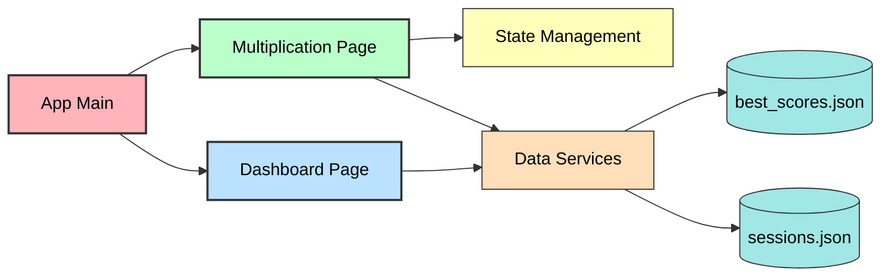
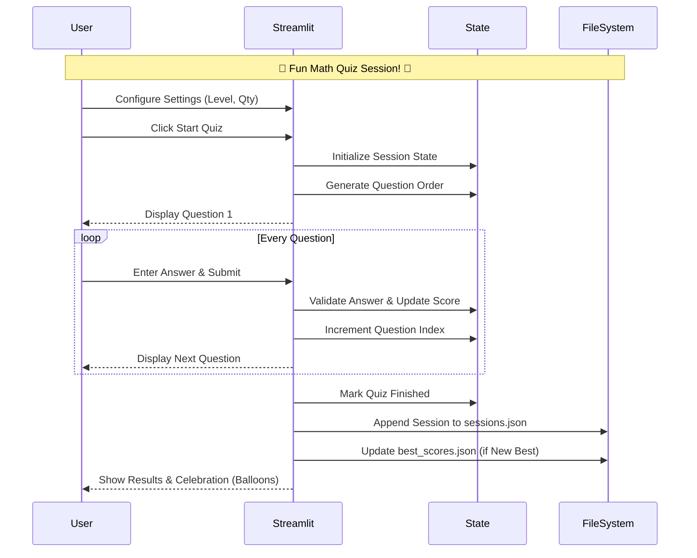

# Math Game Quiz - Design Document

## System Architecture Overview

### High-Level Component Interaction


```
┌─────────────────────────────────────────────────────────┐
│                    Streamlit Frontend                    │
│         (Multi-page web application for children)        │
└─────────────────────────────────────────────────────────┘
                           │
        ┌──────────────────┼──────────────────┐
        │                  │                  │
    ┌───▼───┐         ┌────▼────┐      ┌────▼─────┐
    │ App   │         │Quiz      │      │Dashboard │
    │(Main) │         │Pages     │      │Page      │
    └───────┘         └──────────┘      └──────────┘
                           │
                           │
    ┌──────────────────────┼──────────────────────┐
    │                      │                      │
┌───▼──────────────┐  ┌───▼──────────────┐  ┌───▼──────────┐
│ State Management │  │ Data Services    │  │ Session Store│
│ (session_state)  │  │ (JSON helpers)   │  │ (JSON files) │
└──────────────────┘  └──────────────────┘  └──────────────┘
                           │
        ┌──────────────────┼──────────────────┐
        │                  │                  │
    ┌───▼────────┐   ┌────▼──────┐   ┌──────▼─────┐
    │best_scores │   │sessions    │   │Pandas/Math │
    │.json       │   │.json       │   │utilities   │
    └────────────┘   └────────────┘   └────────────┘
```

---

## Component Architecture

### 1. Main Application (`app.py`)
**Purpose**: Landing page and navigation hub

**Responsibilities**:
- Set page configuration (title, icon, layout)
- Display welcome message
- Provide sidebar navigation links
- Explain available features

**Key Components**:
```
st.set_page_config(
  page_title="Math Quiz Game",
  page_icon="🧮",
  layout="wide"
)
st.title("🧮 Math Quiz Game")
```

**Dependencies**:
- Streamlit core only
- No external data dependencies

---

### 2. Multiplication Quiz Page (`pages/Multiplication.py`)
**Purpose**: Interactive timed multiplication quiz experience

**Structure**:

#### 2.1 Constants & Configuration
```python
SCORES_FILE = Path("best_scores.json")
SESSIONS_FILE = Path("sessions.json")
LEVELS = {
    "Easy (1–6)": 6,
    "Medium (1–12)": 12,
    "Hard (1–20)": 20,
}
```

#### 2.2 JSON Data Services Module
**Functions**:
- `_safe_load_json(path, default)` - Safe JSON reading with error recovery
- `_safe_save_json(path, data)` - Safe JSON writing with UTF-8 encoding
- `load_best_scores()` - Load daily best scores
- `save_best_scores(scores)` - Persist best scores
- `load_sessions()` - Load session history
- `append_session(session_row)` - Append new session record

**Pattern**: All JSON operations wrapped with try-except, return sensible defaults on failure

#### 2.3 Quiz Mode Management
**Functions**:
- `make_mode_key(tables, level, total_q, seconds_per_q)` - Generate SHA256 hash of configuration
- `update_best_score(mode_key, score, total_q)` - Compare and update daily best
- `get_today_best(mode_key)` - Retrieve today's best for a mode
- `settings_fingerprint(tables, level, total_q, seconds_per_q)` - JSON representation for comparison

**Purpose**: Enable mode-specific best score tracking and settings change detection

#### 2.4 Quiz State Management

### Quiz Session Sequence Diagram


**Session State Keys**:
```python
# Quiz control
quiz_started: bool
quiz_finished: bool
finalized_session: bool  # Prevent re-saving
celebrated: bool  # Show balloons once

# Question management
order: list[tuple[int, int]]  # [(table, multiplier), ...]
idx: int  # Current question index
current_q: tuple[int, int]  # Current question

# Scoring
score: int  # Count of correct answers
attempts: int  # Total answer submissions
history: list[dict]  # Full answer history
last_feedback: str  # Last answer feedback message

# Timing
start_ts: float  # Question start timestamp
deadline_ts: float  # Question deadline timestamp
seconds_per_q: int  # Config value

# Metadata
mode_key: str  # SHA256 hash of configuration
mode_meta: dict  # Full configuration metadata
session_id: str  # Unique session identifier
```

**Functions**:
- `reset_quiz_state()` - Clear all quiz-related session state
- `start_quiz(tables, level, max_mult, total_q, sec_per_q)` - Initialize quiz session
- `advance_question_or_finish()` - Move to next question or mark quiz complete

#### 2.5 Question Generation & Validation
**Functions**:
- `generate_questions(tables, max_multiplier, total_q)` - Create shuffled question list
  - Algorithm: Create all unique pairs, shuffle, fill extras if needed
  - Returns: `[(table, multiplier), ...]` in random order
  
- `submit_answer(answer_text)` - Process user answer
  - Validates numeric input
  - Compares against correct answer
  - Records result and advances question
  
- `record_result(result, answer, correct, elapsed)` - Add to history
  - Results: CORRECT, WRONG, TIMEOUT, INVALID
  - Records elapsed time to 1/1000 second precision
  
- `record_timeout()` - Handle timer expiration
  - Called when countdown reaches 0
  - Records TIMEOUT result
  - Advances to next question

#### 2.6 Analytics & Reporting
**Functions**:
- `compute_speed(history)` - Calculate speed metrics
  - Returns: avg_time_all, avg_time_answered, qpm (questions/minute)
  - Handles empty history gracefully
  
- `per_table_breakdown(history)` - Analyze performance by table
  - Groups results by multiplication table
  - Calculates accuracy per table
  - Returns pandas DataFrame

#### 2.7 UI Rendering Phases

**Phase 1: Settings & Setup**
```
Sidebar:
├─ Settings header
├─ Table multiselect (2-20)
├─ Level selectbox
├─ Total questions input
├─ Timer slider
├─ Today's best display
└─ Start/Stop buttons

Main area:
└─ Info message to choose settings
```

**Phase 2: Live Quiz**
```
Header:
├─ Score display (X / Total)
└─ Large countdown timer

Middle:
├─ Mode info (level, tables, question number)
├─ Progress bar
├─ Question display (e.g., "What is 7 × 8?")
├─ Last feedback message
└─ Answer input form

Footer:
└─ Auto-rerun every 250ms for timer update
```

**Phase 3: Results Summary**
```
Header:
├─ "✅ Quiz finished!" heading
└─ Final score (X / Total) in large font

Content:
├─ New best score notification (if applicable)
├─ Speed metrics section
├─ Overall totals breakdown
├─ Per-table breakdown dataframe
└─ Buttons: Play again, Go to Dashboard
```

---

### 3. Dashboard Page (`pages/Dashboard.py`)
**Purpose**: Analytics and session review interface

**Structure**:

#### 3.1 Data Loading
**Functions**:
- `load_sessions()` - Read and parse sessions.json
  - Returns empty list if file missing/corrupt

#### 3.2 Data Transformation
**Pipeline**:
1. Load sessions list from JSON
2. Convert to pandas DataFrame
3. Parse timestamp_iso to datetime objects
4. Sort by timestamp (newest first)
5. Calculate summary metrics
6. Apply user-selected filters
7. Generate trend visualizations

#### 3.3 UI Rendering

**Section 1: Summary Metrics**
```
4 columns displaying:
├─ Total sessions count
├─ Average score
├─ Average accuracy %
└─ Average speed q/min
```

**Section 2: Filters**
```
Expandable section:
├─ Operation multiselect (dynamic from data)
└─ Level multiselect (dynamic from data)

Updates:
├─ Main table (filtered)
└─ Trend charts (filtered)
```

**Section 3: Sessions Table**
```
Columns (auto-filtered):
├─ timestamp_iso
├─ operation
├─ level
├─ tables
├─ total_q
├─ score
├─ accuracy_pct
├─ avg_time_all_s
├─ avg_time_answered_s
├─ speed_q_per_min
└─ seconds_per_q

Sorting: Newest first
Pagination: Streamlit default
```

**Section 4: Trends**
```
2-column layout:
├─ Left: Score over time (line chart)
└─ Right: Speed over time (line chart)

Data source: Filtered sessions sorted by timestamp
Fallback: "Not enough data..." messages if <2 sessions
```

---

### 4. Addition Quiz Page (`pages/Addition.py`)
**Purpose**: Interactive timed addition quiz

**Key State Variables**:
- `st.session_state.min_num`: int
- `st.session_state.max_num`: int
- `st.session_state.current_q`: tuple[int, int]

**Functions**:
- `generate_addition_questions(min_num, max_num, total_q)`
- `validate_addition_answer(answer_text, num1, num2)`

---

### 5. Subtraction Quiz Page (`pages/Subtraction.py`)
**Purpose**: Age-appropriate subtraction quiz

**Logic Constraints**:
- Ensure `num1 >= num2` to avoid negative results
- Difficulty levels set ranges: Beginner (1-10), Intermediate (1-20), Advanced (1-50)

---

### 6. Division Quiz Page (`pages/Division.py`)
**Purpose**: Interactive timed division quiz

**Special Handling**:
- Divisor != 0 validation
- Toggle for "Whole Numbers Only" vs "With Remainders"
- Dividend generated as multiple of divisor for "Whole Numbers Only" mode

---

### 7. Difficulty Progression System
**Purpose**: Automatic scaling of quiz difficulty

**Mechanism**:
- Monitor last 3 sessions accuracy
- If >90% consistently, suggest higher level
- If <60% consistently, suggest lower level

---

### 8. Audio Feedback Service
**Purpose**: Sound effects for quiz engagement

**Events**:
- `PLAY_CORRECT_SOUND`: On ✅ answer
- `PLAY_WRONG_SOUND`: On ❌ answer
- `PLAY_TIMER_WARNING`: At 5 seconds remaining

---

### 9. Mobile Responsive Layout
**Purpose**: UI optimization for smaller screens

**Implementation**:
- Media queries via Streamlit custom CSS
- Sidebar stacking logic
- Larger tap targets for mobile devices

---

## Data Models

### Session Record
```python
{
    "session_id": "mul-1699564800-5432",
    "timestamp_iso": "2024-11-10T14:30:00",
    "operation": "multiplication",
    "tables": [2, 3, 4, 5],
    "level": "Medium (1–12)",
    "multiplier_max": 12,
    "seconds_per_q": 10,
    "total_q": 20,
    "score": 18,
    "correct": 18,
    "wrong": 2,
    "timeout": 0,
    "invalid": 0,
    "answered": 20,
    "accuracy_pct": 90.0,
    "avg_time_all_s": 5.234,
    "avg_time_answered_s": 5.234,
    "speed_q_per_min": 11.47
}
```

### Best Score Entry (Per Mode, Per Day)
```python
{
    "mode_key_1": {
        "2024-11-10": {
            "score": 20,
            "out_of": 20,
            "updated_at_epoch": 1699564800
        },
        "2024-11-09": {
            "score": 18,
            "out_of": 20,
            "updated_at_epoch": 1699478400
        }
    },
    "mode_key_2": { ... }
}
```

### Mode Key Generation
```python
SHA256(JSON.stringify({
    "operation": "multiplication",
    "tables": [2, 3, 4, 5],  # sorted
    "level": "Medium (1–12)",
    "total_q": 20,
    "seconds_per_q": 10
}))[:16]  # First 16 characters
```

### Question History Entry
```python
{
    "table": 7,
    "multiplier": 8,
    "your_answer": 56,
    "correct": 56,
    "result": "CORRECT",  # CORRECT | WRONG | TIMEOUT | INVALID
    "elapsed_s": 2.345
}
```

---

## State Management & Lifecycle

### Quiz Lifecycle State Machine

```
┌─────────────────────────────────────────────────────────┐
│                     START: Landing                       │
│         Display settings, no quiz_started flag           │
└────────────────┬────────────────────────────────────────┘
                 │
                 │ User clicks "Start"
                 │ reset_quiz_state() called
                 │ start_quiz() called
                 ▼
┌─────────────────────────────────────────────────────────┐
│                    QUIZ ACTIVE                           │
│  quiz_started=True, quiz_finished=False, idx < len      │
│  Display question, timer, score, input form             │
└─────┬───────────────────────┬──────────────────┬────────┘
      │                       │                  │
      │ User submits          │ Timer reaches 0  │ User closes
      │ valid answer          │ (auto advance)   │ browser
      │ submit_answer()       │ record_timeout() │ (auto reset)
      │                       │ advance_q()      │
      ▼                       ▼                  ▼
┌─────────────────────────────────────────────────────────┐
│              QUIZ COMPLETE / AUTO-ADVANCE                │
│   advance_question_or_finish() moves idx forward         │
│   If idx >= len(order): quiz_finished = True            │
└────────────────┬────────────────────────────────────────┘
                 │
                 │ idx >= len(order) detected
                 │
                 ▼
┌─────────────────────────────────────────────────────────┐
│              RESULTS DISPLAY (First Load)               │
│  quiz_finished=True, finalized_session=False             │
│  Save session to JSON, calculate metrics, show results   │
│  Set finalized_session=True, show balloons once          │
└────────────────┬────────────────────────────────────────┘
                 │
      ┌──────────┴──────────┬──────────────┐
      │                     │              │
      │ "Play again"        │ "Dashboard"  │ Settings change
      │ reset_quiz_state()  │ page_link()  │ auto-reset
      │ st.rerun()          │              │
      ▼                     ▼              ▼
   [START]           [Dashboard]      [START]
```

### Settings Change Detection
```python
# Create fingerprint of current settings
fp_now = settings_fingerprint(tables, level, total_q, seconds_per_q)

# Compare with previous settings
last_fp = st.session_state.get("last_settings_fp")

# If changed and quiz was finished, reset state
if last_fp and last_fp != fp_now and quiz_finished:
    reset_quiz_state()

# Store current for next comparison
st.session_state["last_settings_fp"] = fp_now
```

---

## File Structure & Persistence

### best_scores.json
```
Location: /root directory
Format: JSON object (dict)
Structure: {
    "mode_key_hash": {
        "YYYY-MM-DD": {
            "score": int,
            "out_of": int,
            "updated_at_epoch": int
        },
        ...
    },
    ...
}
Access: 
  - Read: load_best_scores()
  - Write: save_best_scores(scores)
  - Update: update_best_score() merges into existing
Fallback: Empty dict if missing/corrupt
```

### sessions.json
```
Location: /root directory
Format: JSON array (list of objects)
Structure: [
    { session_record_1 },
    { session_record_2 },
    ...
]
Access:
  - Read: load_sessions()
  - Append: append_session(new_record)
Fallback: Empty list if missing/corrupt
Note: Append-only, never overwrites existing
```

---

## Timer & Performance Handling

### Timer Mechanism
```python
# At quiz start
start_ts = time.time()
deadline_ts = start_ts + seconds_per_q

# On each page load (auto-runs every 250ms)
now = time.time()
remaining = max(0, int(deadline_ts - now))

# Display countdown
st.markdown(f"⏳ {remaining}s")

# Check timeout
if remaining <= 0:
    record_timeout()
    st.rerun()

# Force rerun to keep timer updating
time.sleep(0.25)
st.rerun()
```

### Elapsed Time Recording
```python
# When answer submitted
elapsed = time.time() - start_ts

# Record to 3 decimal places
record_result(..., elapsed_s=float(elapsed))

# Later calculations round to 3 decimals
"avg_time_answered_s": round(speed["avg_time_answered"], 3)
```

---

## Error Handling Strategy

### 1. JSON Operations
```
Read operation:
├─ Check if file exists
├─ Try JSON parse
├─ On error: return default ([] or {})
└─ Continue execution

Write operation:
├─ Serialize to JSON string
├─ Write with UTF-8 encoding
├─ On error: log, continue
└─ Rely on existing file
```

### 2. Input Validation
```
Answer submission:
├─ Attempt int() conversion
├─ On ValueError: record INVALID, show error message
├─ Continue to next question
└─ Don't block quiz progression
```

### 3. Data Integrity
```
Session save:
├─ Calculate before saving
├─ Save only after calculation
├─ Use finalized_session flag to prevent re-saves
└─ If re-run detected, use cached data

Best score update:
├─ Load current data
├─ Compare new vs existing
├─ Update only if better
├─ Save atomically
└─ Display result to user
```

---

## Security & Privacy Considerations

### 1. Data Storage
- **No authentication**: App is public use (intended for children)
- **No encryption**: JSON files stored in plain text
- **No user identification**: Sessions not tied to specific users
- **Local storage**: Data persists on server running the app

### 2. Input Constraints
- **Timer length**: 2-60 seconds (reasonable bounds)
- **Total questions**: 1-500 (prevents DOS from excessive generation)
- **Table selection**: 2-20 only (no arbitrary math expressions)
- **Answer input**: Must be valid integer (prevents code injection)

### 3. Recommendations (Future)
- Consider adding password protection if made publicly accessible
- Implement rate limiting on session creation
- Add periodic data backups
- Consider GDPR compliance for future user profile feature

---

## Technology Stack

### Backend & Frontend
- **Framework**: Streamlit (Python web framework)
- **Data Processing**: Pandas
- **File I/O**: Python pathlib and json modules
- **Scripting**: Python 3.7+

### Dependencies
```
streamlit>=1.28.0
pandas>=1.5.0
```

### File Format
- **Persistent Data**: JSON (UTF-8 encoded)
- **Configuration**: Python constants in files

### Operational Model
- Intended to run as a single-process Streamlit application (local or behind a simple reverse proxy).
- Visual feedback on correctness provided by the Streamlit UI.
- Single machine runtime (no distributed architecture by default).
- Shared filesystem expected for `best_scores.json` and `sessions.json` when multiple instances are used.

---

## Performance Characteristics

### Quiz Performance
- **Question generation**: <1 second for 500 questions
- **Answer processing**: <50ms per submission
- **Page rerun**: ~250ms with timer update
- **Total timer accuracy**: ±250ms (acceptable for learning)

### Dashboard Performance
- **Load time**: <500ms for 1000 sessions
- **Filter application**: <100ms
- **Trend chart rendering**: <200ms
- **Memory usage**: ~50MB for 100,000 session records

### Scalability Limits
- **JSON file size**: Practical limit ~100MB (100k sessions)
- **Best scores file**: Practical limit 10,000 mode keys
- **Concurrent users**: Single instance handles ~10 simultaneous
- **Session duration**: 5-30 minutes typical

---

## Testing Strategy

### Unit Tests (Not implemented yet)
- JSON helper functions (error cases)
- Mode key generation (consistency)
- Question generation (randomness, uniqueness)
- Speed calculation (edge cases with empty history)
- Per-table breakdown (accuracy calculation)

### Integration Tests (Not implemented yet)
- Complete quiz flow (start → answers → results)
- Session persistence (JSON write/read)
- Best score updates (comparison logic)
- Settings change detection (fingerprint matching)
- Dashboard filtering (data transformations)

### Manual Testing Checklist
- [ ] Start quiz with different settings
- [ ] Answer correctly, incorrectly, timeout
- [ ] Invalid input (text, empty, decimals)
- [ ] View results and best score
- [ ] Check sessions.json and best_scores.json
- [ ] Navigate to Dashboard
- [ ] Filter by operation/level
- [ ] Verify trend charts
- [ ] Settings change detection
- [ ] Page refresh during quiz (state recovery)

---

## TEMPLATE: Adding a New Feature to Design.md
**Step 3 in the Feature Development Flow (Kiro Standard)**

After confirming the requirements, architect how to implement them.

### Step 1: Update Component Architecture
Describe system architecture, individual components, and their interactions.

### Step 2: Add Sequence Diagrams
Show how different parts of the system interact to satisfy requirements.

### Step 3: Define Data Models and Interfaces
Document data structures, JSON schemas, and internal/external interfaces.

### Step 4: Technology Stack Recommendations
List the specific technologies, libraries, and frameworks chosen for this feature.

### Step 5: Define Error Handling Approach
How will this specific feature handle internal errors and user-facing failures?

### Step 6: Testing Strategy
What is the specific testing approach for this feature (Unit, Integration, Manual)?

---

## Checklist When Adding Design
- [ ] System architecture and components defined
- [ ] Sequence diagrams included
- [ ] Data models and interfaces documented
- [ ] Technology stack recommendations included
- [ ] Error handling approach specified
- [ ] Testing strategy defined
- [ ] Design meets all requirements (feasibility review)
- [ ] Non-functional requirements (performance, etc.) addressed
- [ ] Ready to move to Architecture.md

### Next Step
After completing Design.md, proceed to **Architecture.md** to update system diagrams.

**FEATURE DEVELOPMENT FLOW CHECKLIST:**
1. ✅ Features.md - Define what feature does
2. ✅ Requirements.md - Define acceptance criteria
3. ✅ Design.md - Architect the solution (YOU ARE HERE)
4. → Architecture.md - Update system diagrams
5. → Tasks.md - Break into development tasks
6. → Implementations.md - Add code examples
7. → Testing.md - Define test strategy
8. → README.md - Update documentation
9. → Release.md - Tag and publish

