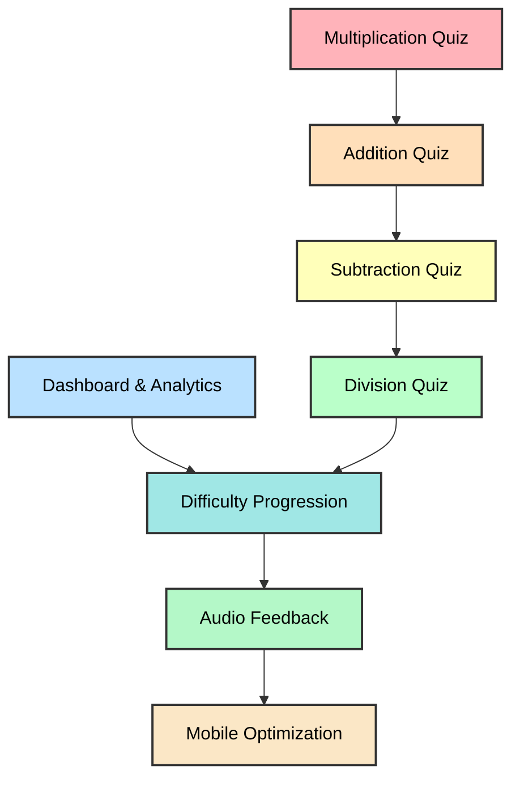

# Math Game Quiz - Features Document

## Overview
A gamified, open-source math quiz application designed for kids to learn and practice fundamental arithmetic operations through interactive, timed quizzes. All sessions are local, one-time use with no data collection or user tracking by default.

---

## Feature Master Table

| Feature ID | Feature Name | Status | Category | Target Version | Operational Impact | Learning Outcome |
|------------|--------------|--------|----------|----------------|-------------------|------------------|
| **F-001** | Multiplication Quiz | ✅ Implemented | Core | v1.0 | None (local JSON storage) | Mental math speed & recall |
| **F-002** | Dashboard & Analytics | ✅ Implemented | Analytics | v1.0 | Low (reads sessions.json; backup recommended) | Self-monitoring & progress |
| **F-003** | Addition Quiz | 🔄 Planned | Core | v2.0 | Low (no external services required) | Basic arithmetic foundation |
| **F-004** | Subtraction Quiz | 🔄 Planned | Core | v2.0 | Low | Concept of difference |
| **F-005** | Division Quiz | 🔄 Planned | Core | v2.0 | Low | Fair sharing & partitioning |
| **F-006** | Difficulty Progression | 🔄 Planned | Gamification | v3.0 | Medium (analytics & compute) | Adaptive learning challenge |
| **F-007** | Audio Feedback | 🔄 Planned | UX | v3.0 | Medium-High (static assets) | Multi-sensory reinforcement |
| **F-008** | Mobile Optimization | 🔄 Planned | UX | v4.0 | Low-Medium (responsive UI testing) | Accessibility & flexibility |

**Legend**: ✅ = Implemented | 🔄 = Planned | 🚫 = Removed

---

## SDD Compliance Reminder
Follow the FEATURE_DEVELOPMENT_FLOW (Features → Requirements → Design → Architecture → Tasks → Implementations → Testing → README → Release). Requirements must be authored first using the EARS pattern (WHEN ... THE SYSTEM SHALL) and include measurable acceptance criteria. For every feature, capture at minimum:
- Operational Impact (None / Low / Medium / High) — availability model, file permissions, env vars, static assets.
- Security & Privacy considerations (if public-facing).
-- Task IDs to create in `spec/Tasks.md` for implementation, tests, and operational documentation (e.g., T-1xx, T-5xx).
- Testability notes (what tests to add and how to verify asset inclusion).

---

## Current Features (Implemented)

### 1. Multiplication Quiz Game (F-001)
**User Story**: 
- **Who**: Student (Age 6-12)
- **What**: Interactive timed multiplication quiz with customizable settings.
- **Why**: To improve mental math speed, accuracy, and recall through consistent practice.

**Success Criteria**:
- Student can complete a quiz with 90%+ accuracy.
- Average response time per question decreases over multiple sessions.
- Student shows mastery of tables 2-20 through local score tracking.

**Features**:
- **Customizable Settings**:
  - Select multiple multiplication tables (2-20)
  - Three difficulty levels (Easy: 1-6, Medium: 1-12, Hard: 1-20)
  - Configure total number of questions (1-500)
  - Adjustable timer per question (2-60 seconds)

- **Quiz Mechanics**:
  - Timed questions with countdown timer display
  - Real-time score tracking (X / Total)
  - Progressive question advancement
  - Visual feedback for correct/wrong/timeout/invalid answers
  - Timer-based auto-advance on timeout

- **Performance Metrics**:
  - Final score and accuracy percentage
  - Per-table breakdown (accuracy, correct, wrong, timeouts)
  - Speed metrics (avg time per question, questions per minute)
  - Session history with timestamps

- **Score Management**:
  - Daily best score tracking per mode configuration
  - Session persistence to JSON
  - Best score display in sidebar

**Operational Considerations**:
- Operational Impact: None for local development; if the app is made accessible over a network, ensure the host allows file write access for `best_scores.json` and `sessions.json` or consider an alternate storage approach.
- Security: If publicly accessible, consider password protection or restricting write-access to JSON files (see `spec/Design.md` note).
- Tasks: Ensure unit tests exist for question generation and JSON helpers (create/assign T-500). Document any operational notes in `spec/Tasks.md` if required.

---

### 2. Dashboard & Analytics (F-002)
**User Story**: 
- **Who**: Student or Parent
- **What**: Comprehensive analytics dashboard to view performance history and trends.
- **Why**: To track progress over time and identify areas that need more practice.

**Success Criteria**:
- All session data is accurately reflected in the dashboard.
- Trend charts clearly show performance improvements (or declines).
- User can filter data to analyze specific arithmetic operations or levels.

**Features**:
- **Session Tracking**:
  - Complete history of all quiz sessions
  - Timestamp tracking for each session
  - Operation type and difficulty level recording
  - Detailed performance metrics per session

- **Analytics & Visualization**:
  - Summary metrics (total sessions, avg score, avg accuracy, avg speed)
  - Filterable session history table
  - Trend visualization (score over time, speed over time)
  - Per-table performance breakdown

- **Filtering & Sorting**:
  - Filter by operation type
  - Filter by difficulty level
  - Chronological sorting with newest first

**Operational Considerations**:
- Operational Impact: Low. Dashboard reads `sessions.json`; when making the app accessible beyond local development, validate file read performance and backup strategy for sessions data.
- Security: If publicly accessible, ensure access control for personally identifying data (none by default) and consider limiting public write access to avoid tampering.
- Tasks: Add T-500/T-501 tests for data transformation; document any environment-specific notes in Tasks entries if required.

---

## Planned Features (Future Releases)

### 3. Addition Quiz Game (F-003)
- Single-digit and double-digit addition
- Variable difficulty levels (Beginner: 1-10, Intermediate: 1-50, Advanced: 1-100)
- Timed questions with configurable timer
- Score and accuracy tracking (session-only)

**Operational Considerations**:
- Operational Impact: Low. No external services required. Add tests for question generation (T-101) and ensure Requirements.md includes EARS acceptance criteria.
- Tasks: Create T-100 (Implementation) and T-101 (Question gen), plus T-500 tests.

### 4. Subtraction Quiz Game (F-004)
- Single and double-digit subtraction
- Prevents negative results (age-appropriate)
- Three difficulty levels (Beginner: 1-10, Intermediate: 1-20, Advanced: 1-50)
- Real-time feedback and scoring

**Operational Considerations**:
- Operational Impact: Low.
- Tasks: T-200 (implementation), T-201 (tests)

### 5. Division Quiz Game (F-005)
- Division with whole number and remainder handling
- Selectable dividend and divisor ranges
- Error handling for division by zero
- Three difficulty levels

**Operational Considerations**:
- Operational Impact: Low.
- Tasks: T-201 (implementation), ensure Requirements.md covers remainder vs whole-number options.

### 6. Difficulty Progression System (F-006)
- Automatic difficulty increase recommendation on consistent high scores (3+ sessions >90% accuracy)
- Difficulty decrease suggestion on struggling sessions (3+ sessions <60% accuracy)
- Recommended difficulty suggestions in sidebar
- Manual difficulty selection always available

**Operational Considerations**:
- Operational Impact: Medium. Requires analyzing session history and may increase compute/minor storage. Document expected data volume and performance constraints in `Requirements.md` and `Design.md`.
- Tasks: Create T-300 and include performance acceptance criteria (see `spec/Tasks.md` T-003).

### 7. Audio Feedback (F-007)
- Correct answer "ding" sound effect
- Incorrect answer "buzz" sound effect
- Timer warning sound at 5 seconds remaining
- Quiz completion celebratory sound
- Mutable toggle in settings

**Operational Considerations**:
- Operational Impact: Medium-High. Adds static audio assets and requires ensuring those assets are included with releases or made available via a static hosting option. Document asset inclusion requirements in task entries.
- Tasks: Create audio assets, add T-400 for implementation, and document asset handling notes in Tasks.md.

### 8. Mobile-Optimized UI (F-008)
- Responsive design for tablets and mobile devices
- Touch-friendly input methods
- Mobile-specific layouts with larger buttons
- Optimized font sizes for readability

**Operational Considerations**:
- Operational Impact: Low-Medium. Mainly CSS and testing; include mobile compatibility testing in T-502 (Manual Testing Checklist).
- Tasks: Add dedicated UI testing steps to Testing.md and Tasks.md.

---

## TEMPLATE: Adding a New Feature to Features.md
**Step 1 in the Feature Development Flow (Kiro/SpecKit Standard)**

When adding a new feature (e.g., Addition Quiz), start with a clear User Story, Success Criteria, and explicit Operational Impact statement.

### Feature Master Table update
- Add new row to the Feature Master Table at the top of the file with status 🔄 Planned and an Operational Impact value (None / Low / Medium / High).

### Required sections for new feature entry
1. User Story (Who, What, Why)
2. Success Criteria (measurable outcomes)
3. Features / Sub-features list
4. Operational Considerations (availability model, env vars, static assets, security)
5. Testability notes (unit/integration tests to add) and pointers to Task IDs (T-xxx)
6. Feature Dependencies (update diagram)
7. Learning Outcomes

### Example: Minimal Feature Entry
**Feature Name**: Addition Quiz — 🔄 Planned | Core | v2.0 | Operational Impact: Low

**User Story**: ...

**Success Criteria**: ...

**Operational Considerations**: Add T-100 (implementation), T-500 (unit tests), and document any hosting/operational notes if required. Use EARS format in `Requirements.md`.

### Step Guidance (practical)
- Add to Feature Master Table.
- Draft Requirements.md entry using EARS (WHEN ... THE SYSTEM SHALL).
- Create Task IDs in `spec/Tasks.md` for implementation (T-1xx) and tests (T-5xx); note any operational documentation needs in Tasks.md.
- After Requirements.md is approved, proceed to Design.md and follow the 9-step SDD flow. Ensure Release.md is updated appropriately during finalization.

---

## Checklist When Adding Feature
- [ ] Added to Feature Master Table (include Operational Impact)
- [ ] User Story defined (Who, What, Why)
- [ ] Success Criteria specified (measurable)
- [ ] Status set correctly (🔄 Planned)
- [ ] Category and version assigned
- [ ] Operational Considerations captured (availability model, env vars, assets)
- [ ] Testability notes added (unit/integration tests required)
- [ ] Feature description added with sub-features
- [ ] Updated Feature Dependencies diagram
- [ ] Learning outcomes defined
- [ ] Tasks created for implementation and tests (T-xxx, T-5xx); document operational notes as needed
- [ ] Ready to move to Requirements.md (Requirements-First Approach)

### Next Step
After completing Features.md, proceed to **Requirements.md** to define acceptance criteria using EARS (WHEN...THE SYSTEM SHALL). Create matching task IDs in `spec/Tasks.md` for implementation (T-xxx) and testing (T-5xx); document any operational notes in Tasks entries if required.

**FEATURE DEVELOPMENT FLOW CHECKLIST:**
1. ✅ Features.md - Define what feature does (YOU ARE HERE)
2. → Requirements.md - Define acceptance criteria (EARS)
3. → Design.md - Architect the solution
4. → Architecture.md - Update system diagrams
5. → Tasks.md - Break into development tasks
6. → Implementations.md - Add code examples
7. → Testing.md - Define test strategy
8. → README.md - Update documentation
9. → Release.md - Tag and publish

---

## Feature Dependencies

**Important Architecture Notes**:
- ✅ No user authentication or profiles by default
- ✅ No server-side data collection by default
- ✅ All sessions are local and one-time
- ✅ No progress tracking across sessions (unless a feature explicitly adds persistent tracking)
- ✅ Data cleared on session exit (unless feature design requires otherwise)
- ✅ Fully offline capable by default
- Security note: Consider adding password protection if the app is made publicly accessible; document this in the feature's Operational Considerations and in `spec/Tasks.md` where appropriate.

---

## Learning Outcomes

### Student Mastery
- Accuracy improvements across sessions
- Speed improvements (questions per minute)
- Mastery of specific multiplication tables (2-20)
- Successful progression through difficulty levels

### Educational Impact
- Increased confidence in mental math
- Consistent daily practice habit
- Error reduction on challenging number pairs
- Improved recall of basic arithmetic facts

